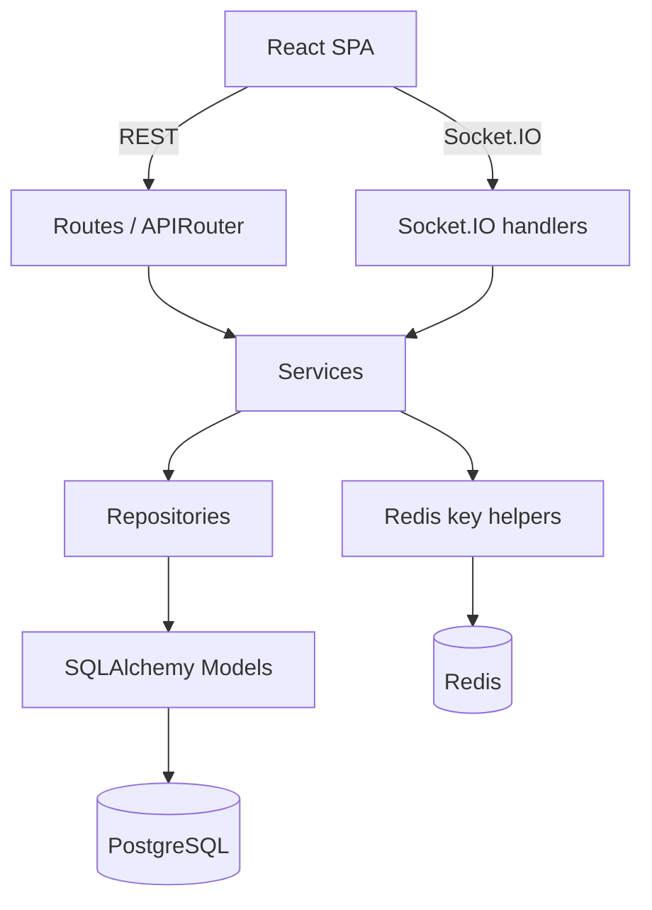
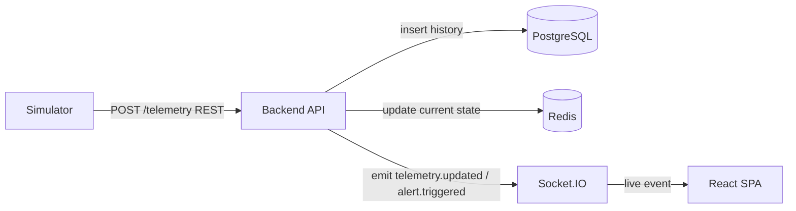

# Domain Map

A learning and reference document that maps the **Fleet Operations Console** domain onto the
planned backend building blocks: models, tables, repositories, services, schemas, and routes.

> **Status disclaimer:** This document is **mostly forward-looking**. With the exception of the
> minimal `/health` endpoint and the database/session foundation, **none of the domains below are
> implemented yet**. Each domain is marked with an explicit implementation status. This file
> describes the *intended* shape of the system so the build stays consistent — it is a map, not a
> claim that the territory exists.

> **Sources:** Requirements come from [`onboarding-project-spec.md`](onboarding-project-spec.md)
> (authoritative). Architecture and layering come from [`architecture.md`](architecture.md). Stack
> rationale comes from [`stack-decisions.md`](stack-decisions.md).

---

## 1. Coming from Java / Spring Boot

If your mental model is Spring Boot, the FastAPI stack maps almost one-to-one. The biggest
difference is that there is **no single "Entity" annotation that is also your API contract** — in
this project persistence (SQLAlchemy models) and API contracts (Pydantic schemas) are deliberately
*separate types*. That separation is enforced by the project rules: SQLAlchemy models represent
persistence only, Pydantic schemas represent the wire contract.

### Concept mapping table

| Spring Boot concept | This project (FastAPI) | Where it lives |
|---|---|---|
| `@Entity` class | SQLAlchemy model | `backend/app/models/` |
| `@Repository` / `JpaRepository` | Repository class | `backend/app/repositories/` |
| `@Service` | Service class | `backend/app/services/` |
| `@RestController` / `@Controller` | Route handler / `APIRouter` | `backend/app/api/` |
| DTO / request & response object | Pydantic schema | `backend/app/schemas/` |
| Flyway / Liquibase migrations | Alembic migrations | `backend/alembic/` |
| `application.yml` / `@ConfigurationProperties` | Typed `Settings` (`pydantic-settings`) | `backend/app/core/` |
| `JdbcTemplate` / `EntityManager` | SQLAlchemy async session | `backend/app/db/` |
| Spring Cache / `RedisTemplate` | Redis client + key helpers | `backend/app/cache/` |
| WebSocket `@MessageMapping` | Socket.IO event handlers | `backend/app/sockets/` |

### Layering rules (same intent as Spring)

- **Routes are thin.** They receive the HTTP request, validate via Pydantic, and call a service.
  Equivalent to a lean `@RestController` that delegates to a `@Service`.
- **Services hold business logic.** Orchestration, alert evaluation, command lifecycle.
- **Repositories own database access.** No SQL in routes or services-as-controllers; the
  repository is the only place that touches the session, like a `JpaRepository`.
- **Schemas validate the wire.** Like DTOs, never reused as persistence entities.

---

## 2. Layered architecture diagram

Routes and Socket.IO handlers are the only entry points. They call services. Services reach durable
data through repositories and models into PostgreSQL, and reach ephemeral/operational data through
Redis key helpers into Redis. Nothing skips a layer.

---

## 3. Telemetry flow diagram

This is the heartbeat of the system. The simulator only ever talks to the backend over REST. The
backend validates, persists durable history in PostgreSQL, updates the fast current-state cache in
Redis, evaluates alert rules, and pushes live events through Socket.IO to the frontend.

---

## 4. Domain overview

Each domain below lists its purpose, where it is stored, the planned table/model, the planned
repository, the planned service, related routes or events, and its implementation status.

> Across the board, **implementation status is "planned / not implemented yet"** unless a row says
> otherwise. The current codebase has the FastAPI app, the typed settings, the async DB session
> foundation, and Alembic infrastructure — but **no business models or migrations yet**.

### 4.1 User

- **Purpose:** Authentication and authorization. Holds the account and its RBAC role
  (`viewer | operator | admin`).
- **Stored in:** PostgreSQL (durable account data). Redis optionally caches nothing here by default.
- **Planned model:** `User` — `id`, `email`, `password_hash` (bcrypt via passlib), `role`,
  timestamps.
- **Planned repository:** `UserRepository` — lookup by email, create, list, update role, delete.
- **Planned service:** `UserService` / `AuthService` — password hashing, credential checks,
  user management.
- **Related routes/events:** `POST /api/auth/login`, `POST /api/auth/refresh`,
  `POST /api/auth/logout`, and admin-only `/api/users` CRUD.
- **Status:** planned / not implemented yet.

### 4.2 Agent

- **Purpose:** A registered vehicle/device in the fleet. The durable registry of "what exists".
- **Stored in:** PostgreSQL (durable registry). Redis optionally mirrors operational fields like
  `last_seen` / current status for fast access.
- **Planned model:** `Agent` — `id`, `name`, `type`, registration metadata, `last_seen`,
  `current_state`.
- **Planned repository:** `AgentRepository` — register, deregister, get by id, list.
- **Planned service:** `AgentService` — registration rules, ensure-exists for the simulator,
  current-state assembly.
- **Related routes/events:** `GET /api/agents`, `GET /api/agents/{id}`,
  `POST /api/agents` (admin), `DELETE /api/agents/{id}` (admin),
  `GET /api/agents/current-state`.
- **Status:** planned / not implemented yet.

### 4.3 Telemetry

- **Purpose:** The append-heavy time-series stream — every agent's GPS, speed, battery, status
  over time. Used for history and charts.
- **Stored in:** PostgreSQL (durable, append-heavy history; eventually partitioned + retention).
  Not stored long-term in Redis.
- **Planned model:** `Telemetry` — `agent_id`, `timestamp`, `lat`, `lng`, `speed`, `battery`,
  `status`.
- **Planned repository:** `TelemetryRepository` — insert a reading, query history for an agent
  (for charts).
- **Planned service:** `TelemetryService` — validate and ingest a reading, persist history,
  trigger current-state update and alert evaluation.
- **Related routes/events:** `POST /api/agents/{id}/telemetry` (ingest),
  `GET /api/agents/{id}/history` (chart data); emits `telemetry.updated` over Socket.IO.
- **Status:** planned / not implemented yet.

### 4.4 Current State

- **Purpose:** The latest-known reading per agent, so the map paints instantly on load without
  scanning telemetry history.
- **Stored in:** Redis (primary, fast operational cache). PostgreSQL only as an optional fallback
  (derivable from the newest telemetry row).
- **Planned model:** No dedicated SQLAlchemy model — this is a **derived cache view**, not a table.
- **Planned repository/helper:** Redis key helper, e.g. `agent:{id}:state`, plus `last_seen`
  tracking used by offline detection.
- **Planned service:** Updated by `TelemetryService` on each ingest; read by `AgentService` for the
  `current-state` snapshot.
- **Related routes/events:** `GET /api/agents/current-state`; reflected in `telemetry.updated`
  events.
- **Status:** planned / not implemented yet.

### 4.5 AlertRule

- **Purpose:** Operator-defined conditions, e.g. "battery < 15%", "speed > 90", "offline > 60s".
- **Stored in:** PostgreSQL (durable business rules). Redis may cache active rules later for fast
  evaluation.
- **Planned model:** `AlertRule` — `id`, `scope` (agent or global), `metric`, `operator`,
  `threshold`, `owner`.
- **Planned repository:** `AlertRuleRepository` — CRUD, list active rules.
- **Planned service:** `AlertService` — evaluate rules against incoming telemetry, decide when a
  rule trips.
- **Related routes/events:** `GET /api/rules`, `POST /api/rules` (operator/admin),
  `PATCH /api/rules/{id}`, `DELETE /api/rules/{id}`.
- **Status:** planned / not implemented yet.

### 4.6 Alert

- **Purpose:** A record that a rule tripped for an agent. The alert log/history.
- **Stored in:** PostgreSQL (durable audit/history). Redis may hold an optional active-alert count.
- **Planned model:** `Alert` — `id`, `rule_id`, `agent_id`, `triggered_at`, `resolved_at`, `value`.
- **Planned repository:** `AlertRepository` — create on trip, list for the alert log.
- **Planned service:** `AlertService` — persist a triggered alert and emit the live event.
- **Related routes/events:** `GET /api/alerts`; emits `alert.triggered` over Socket.IO.
- **Status:** planned / not implemented yet.

### 4.7 Command

- **Purpose:** An operator-issued instruction to a vehicle (e.g. ping, recall, set status) with an
  acknowledgement lifecycle.
- **Stored in:** PostgreSQL (durable audit/history and lifecycle). Redis may hold optional pending
  metadata.
- **Planned model:** `Command` — `id`, `agent_id`, `issued_by`, `type`, `payload`, `status`,
  timestamps. Status is always one of `pending | acknowledged | failed | expired`.
- **Planned repository:** `CommandRepository` — create pending, update status, list history.
- **Planned service:** `CommandService` — create command, forward to simulator, apply ACK,
  enforce status transitions and expiry.
- **Related routes/events:** `POST /api/commands` (operator/admin), `GET /api/commands`,
  `POST /api/commands/{id}/ack` (simulator callback); emits a command-ACK event over Socket.IO.
- **Status:** planned / not implemented yet.

### 4.8 RefreshToken

- **Purpose:** Server-side tracking and revocation of JWT refresh tokens (logout, session
  lifetime).
- **Stored in:** Redis (TTL + revocation). Not in PostgreSQL.
- **Planned model:** No SQLAlchemy model — represented as Redis keys with TTL.
- **Planned repository/helper:** Redis key helper, e.g. `refresh:{token_id}`, with store, lookup,
  and revoke operations.
- **Planned service:** `AuthService` — issue, validate, rotate, and revoke refresh tokens.
- **Related routes/events:** `POST /api/auth/refresh`, `POST /api/auth/logout`.
- **Status:** planned / not implemented yet.

### 4.9 Presence

- **Purpose:** Ephemeral "who is online" — a count or list of connected operators in the console.
- **Stored in:** Redis (ephemeral connection state). Not in PostgreSQL.
- **Planned model:** No SQLAlchemy model — represented as Redis keys/sets keyed by connected
  socket/user.
- **Planned repository/helper:** Redis key helper, e.g. `presence:operators`, updated on
  connect/disconnect.
- **Planned service:** Handled in the Socket.IO layer / a small presence helper in services.
- **Related routes/events:** Socket.IO connect/disconnect lifecycle; emits a presence event.
- **Status:** planned / not implemented yet.

---

## 5. Quick reference: storage at a glance

| Domain | PostgreSQL | Redis | Dedicated model? |
|---|:---:|:---:|:---:|
| User | Yes | — | Yes |
| Agent | Yes | Optional (last_seen) | Yes |
| Telemetry | Yes | — | Yes |
| Current State | Optional fallback | Yes (primary) | No (derived) |
| AlertRule | Yes | Optional cache | Yes |
| Alert | Yes | Optional count | Yes |
| Command | Yes | Optional pending meta | Yes |
| RefreshToken | — | Yes | No (Redis keys) |
| Presence | — | Yes | No (Redis keys) |

This mirrors the **Cache vs Database Policy** table in [`architecture.md`](architecture.md); that
table is the authoritative version if the two ever diverge.
